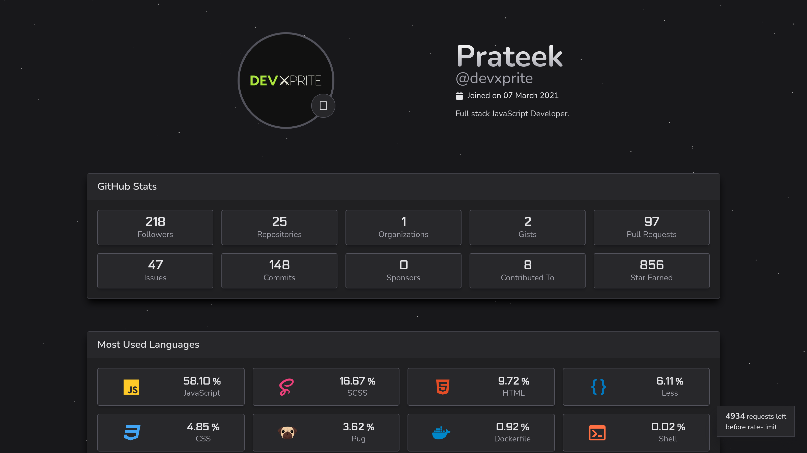
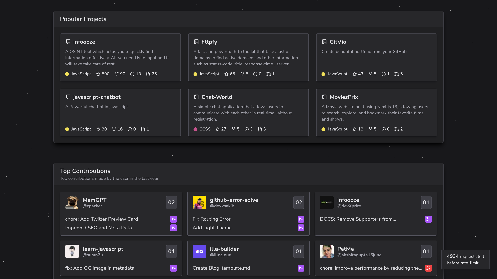
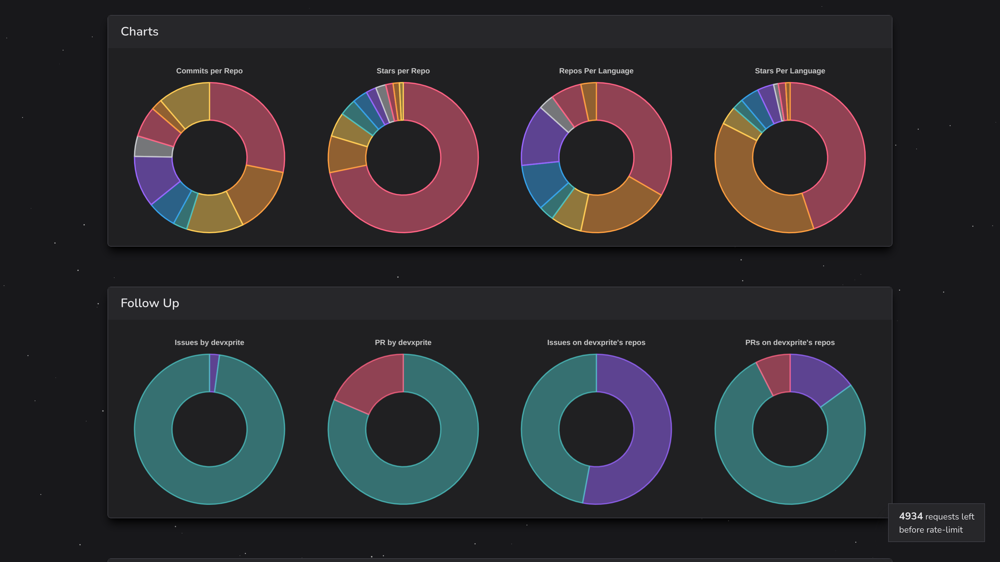
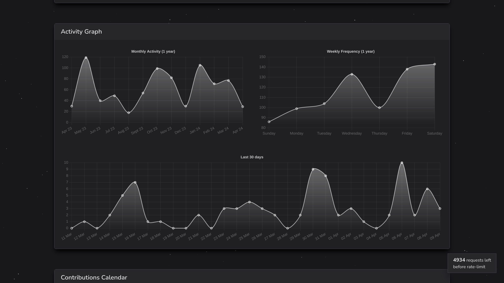
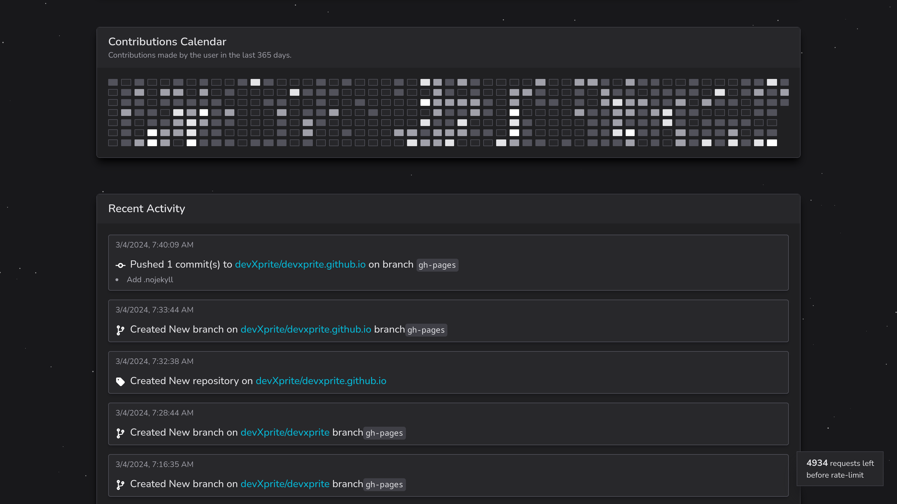

# GitGlance
A tool for visualizing GitHub profiles.
Visit our website [GitGlance](https://gitglance.vercel.app/) 

## Table of Contents
- [About Us](#about-us)
- [Tech stack](#tech-stack)
- [Features](#features)
- [GitGlance Application](#gitglance-application)
- [Setting up the project](#setting-up-the-project)
- [Contributing](#contributing)
- [How to Contribute](#how-to-contribute)
- [Code of Conduct](#code-of-conduct)

## About Us
GitGlance is a powerful tool for visualizing a developer's GitHub profile, showcasing their contributions, fields of expertise, and much more. With GitGlance, developers can gain insights into their GitHub activity in an intuitive and visually appealing manner.

## Tech stack
GitGlance utilizes the following technologies and libraries:

- [Next.js](https://nextjs.org/)
- [Tailwind CSS](https://tailwindcss.com/)
- [GitHub GraphQL API](https://docs.github.com/en/graphql)
- [Node.js](https://nodejs.org/)

## Features
- **GitHub Profile Visualization**: GitGlance provides a comprehensive visualization of a developer's GitHub profile, including their contributions, repositories, and more.
- **Field of Contributions**: Understand the areas in which the developer contributes the most through a graphical representation.
- **GitHub GraphQL API Integration**: Utilizing the GitHub GraphQL API, GitGlance fetches user data directly from GitHub, ensuring accurate and up-to-date information.
- **Next.js & Tailwind CSS**: Built with Next.js for efficient server-side rendering and Tailwind CSS for easy styling and customization.
- **Responsive Design**: GitGlance is designed to be responsive, ensuring a seamless experience across various devices and screen sizes.
- **Dynamic Chart Generation**: GitGlance employs advanced chart generation techniques to dynamically visualize GitHub data. Whether it's plotting commit timelines, repository language distributions, or pull request statistics, GitGlance generates interactive and customizable charts.

## GitGlance Application







## Setting up the project
To run GitGlance locally, follow these steps:

1. Clone the repository:
   ```bash
    git clone https://github.com/your-username/gitglance.git
   ```

2. Navigate to the project directory:
    ```bash
    cd gitglance
    ```
3. Create a .env file in the root directory of the project by copying the .env.example file:
    ```bash
    cp .env.example .env
    ```
4. Open the .env file and add your GitHub Personal Access Token:
   ```bash
    GITHUB_TOKEN=
   ```
5. Install dependencies:
    ```bash
    npm install
    ```
6. Start the development server:
    ```bash
    npm run dev
    ```
7. Open your browser and visit `http://localhost:3000`

 
## Contributing
Contributions are welcome! If you encounter any issues or have suggestions for improvements, please feel free to open an issue or submit a pull request.


## How to Contribute
We welcome contributions from the community to enhance GitGlance further.You can use GitHub Desktop to manage this repository. Here's how:

1. **Download and Install GitHub Desktop**: 
   - Go to the [GitHub Desktop website](https://desktop.github.com/) and download the GitHub Desktop application.
   - Follow the installation instructions to install GitHub Desktop on your computer.

2. **Clone the Repository**:
   - Open GitHub Desktop and sign in to your GitHub account.
   - Click on the "File" menu, then select "Clone Repository..."
   - Choose the repository you want to clone from the list or enter its URL.
   - Choose the local path where you want to clone the repository and click "Clone".

3. **Make Changes**:
   - After cloning the repository, you can make changes to the files locally using your preferred code editor.

4. **Commit Changes**:
   - Once you've made changes, open GitHub Desktop.
   - You'll see a list of files with changes. Write a summary and description of your changes in the text fields.
   - Click "Commit to main" to commit your changes locally.

5. **Push Changes**:
   - To push your changes to the remote repository on GitHub.com, click "Push origin".

6. **Pull Changes**:
   - If there are changes on the remote repository that you don't have locally, you can pull them by clicking "Fetch origin" or "Pull origin".

7. **Sync Changes**:
   - To synchronize your local repository with the remote repository, click "Sync" to push and pull changes in one step.

That's it! You can now use GitHub Desktop to manage this repository efficiently.


## Code of Conduct
For all the enthusiastic contributers, please refer to the [Code of Conduct](https://github.com/devXprite/gitglance/blob/main/CODE_OF_CONDUCT.md)
